> 📁 **이 폴더는 분석 자료 보관용입니다.** 저장소 루트에는 Streamlit 대시보드가 있습니다 → [../README.md](../README.md)
> `src/` 스크립트는 팀 원본 데이터(`T_PJT2/data/raw`)가 있는 로컬 환경 기준 경로라, 저장소만으로는 다시 실행되지 않습니다. 결과물(`report/`, `image/`, `docs/`)은 그대로 볼 수 있습니다.

# 인구·인프라 기반 소비 예측 & ‘소비 잠재력’ 상권 발굴

**“인구와 인프라 대비 실제 소비가 초과 달성되거나, 반대로 저평가된 동네는 어디인가?”**

- **분석 방법:** 인구(상주·직장·유동)와 인프라(집객시설·교통·아파트)로 **기대 소비액**을 예측하고, 실제 소비액과의 격차(잔차)로 숨은 상권·성장 잠재 상권을 찾는다.
- **분석 범위:** 서울 **25개 자치구 → 425개 행정동**, 2023Q1–2025Q4(12분기)

| 바로 보기 | 경로 |
|---|---|
| 인터랙티브 대시보드 (내려받아 `index.html`을 브라우저로 열기, 오프라인 동작) | [`report/dashboard/`](report/dashboard/) |
| 분석 결과 보고서 (원본) | [`report/분석결과_보고서.md`](report/분석결과_보고서.md) |
| 분석 방법·데이터 정의 (원본) | [`docs/분석방법_및_데이터정의.md`](docs/분석방법_및_데이터정의.md) |
| 상권 키워드 분류·타깃 업종·기회 인사이트 (425개 동) | [`report/상권기회_인사이트_보고서.md`](report/상권기회_인사이트_보고서.md) · [PDF](report/상권기회_인사이트_보고서.pdf) |
| 데이터 사전 — 행정동별 상권 분석 키워드 | [`docs/데이터사전_상권분석_키워드.md`](docs/데이터사전_상권분석_키워드.md) |

## 폴더 구조

```
├─ src/                      분석 코드 (01 → 04 순서로 실행)
│  ├─ 01_build_dataset.py    원본 결합 → 분석용 데이터셋 (data/)
│  ├─ 02_model_residual.py   3개 모델 비교(행정동 단위 교차검증) → 기대 소비·잔차·유형
│  ├─ 03_visualize.py        정적 차트 13종 → image/
│  ├─ 04_export_dashboard.py 대시보드 데이터(data.js) + plotly.min.js 복사
│  └─ 05_build_opportunity_insight.py  키워드 3축 분류·상권 원형·업종 공백·기회 유형 → data/
├─ image/                    PNG 차트 01~13
├─ docs/                     분석 방법·데이터 사전
└─ report/
   ├─ 분석결과_보고서.md
   ├─ 상권기회_인사이트_보고서.md
   └─ dashboard/             index.html · style.css · app.js · data.js · lib/plotly.min.js
```

> 가공 데이터 폴더 `data/`는 저장소에 포함하지 않았다. 원본(`T_PJT2/data`)이 있는 환경에서 `src/01`~`02`를 실행하면 다시 생성된다.
> 대시보드는 `report/dashboard/data.js`에 결과가 들어 있어 `data/` 없이도 동작한다.

---

## 1부. 분석 결과

> 서울 25개 자치구 · 425개 행정동 · 2023Q1–2025Q4 (12분기)
> 인터랙티브 대시보드: [`report/dashboard/index.html`](report/dashboard/index.html) (브라우저로 열기, 인터넷 불필요)
> 방법·데이터 정의: [아래 2부](#2부-분석-방법-및-데이터-정의)

---

### 한눈에 보기

| 항목 | 결과 |
|---|---|
| 모델 설명력 | **R² 0.63** (선형회귀, 처음 보는 동을 맞히는 방식으로 검증) · 평균 오차 약 ×1.6 |
| 소비를 가장 잘 설명하는 것 | **집객시설 수** > 주말 유동 비율(−) > 은행 수 > 직장인구 |
| 초과달성 (기대의 1.5배 이상) | **66곳** |
| 기대수준 | **266곳** |
| 저평가 (기대의 2/3 이하) | **89곳** |
| 떠오르는 잠재상권 (기대 미만 + 격차 축소 중) | **39곳** |
| 데이터점검 (학습·순위 제외) | 4곳 — 아현동, 문래동, 방이2동, 둔촌1동 |

#### 쉽게 말하면
1. 컴퓨터에게 “이 동네에 사람이 이만큼 살고, 일하고, 지나다니고, 가게와 역이 이만큼 있으면 돈이 얼마나 쓰일까?”를 배우게 했습니다.
2. 이렇게 나온 **기대 소비**와 **실제 소비**를 나눈 값이 **배율**입니다.
   - ×1이면 예상과 같고, ×2면 두 배, ×0.5면 절반입니다.
3. 배율이 크게 벗어난 동네가 **숨은 강세 상권**이거나 **덜 개발된 잠재 상권**의 후보입니다.

---

### 1. 데이터 살펴보기

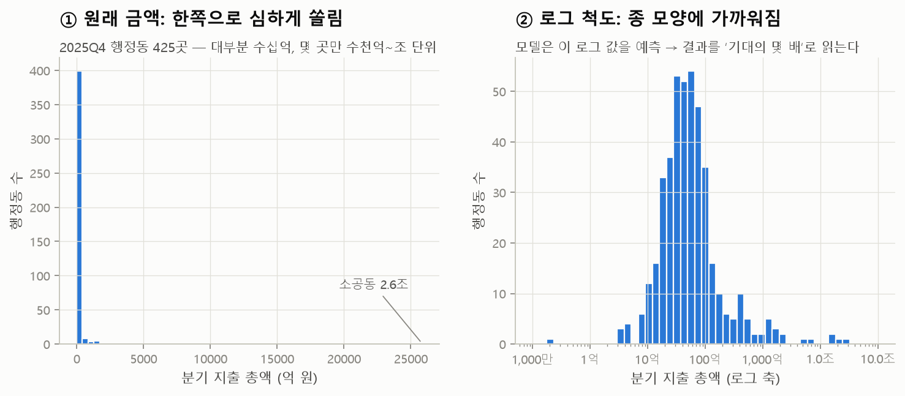

- **돈이 쓰이는 규모의 차이:** 동네마다 차이가 매우 커요. 대부분은 분기 수십억 원이지만 몇 곳은 수천억~조 원이에요.
- **로그로 보는 이유:** 그대로 모델에 넣으면 큰 동네 몇 곳이 결과를 좌우해요. 그래서 **로그 척도**로 바꿔서 예측했어요.

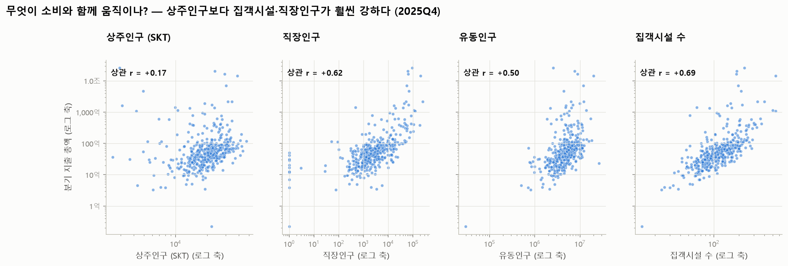

**소비는 ‘사는 사람’보다 ‘모이는 곳’을 따라갑니다.** 상관계수를 비교하면 차이가 뚜렷해요.

| 변수 | 소비와의 상관 |
|---|---|
| 상주인구 | 0.17 |
| 유동인구 | 0.50 |
| 직장인구 | 0.62 |
| 집객시설 | 0.69 |

그래서 서울의 소비 지도는 주거지도보다 **상권·업무지구 지도**에 가깝습니다.

---

### 2. 기대 소비 모델

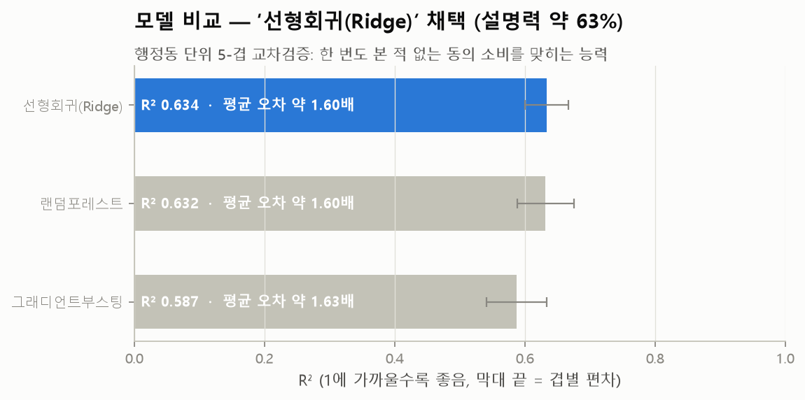

- **모델 비교:** 세 모델을 비교했어요.
  - **선형회귀**와 랜덤포레스트가 R² 0.63으로 거의 같았고, 그래디언트부스팅은 0.59였어요.
  - 해석하기 쉬운 **선형회귀**를 채택했어요.
- **검증 방식:** “한 동네를 통째로 숨기고 맞히기”로 검증했어요.
  - 모델이 특정 동네를 외워서 격차를 지워버리는 일을 막기 위해서예요.

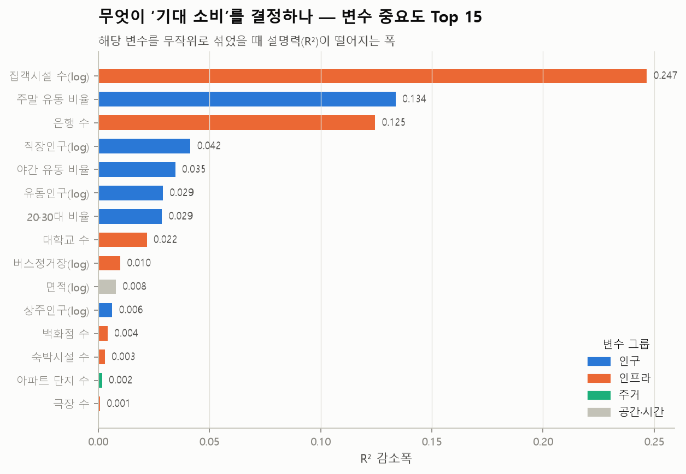
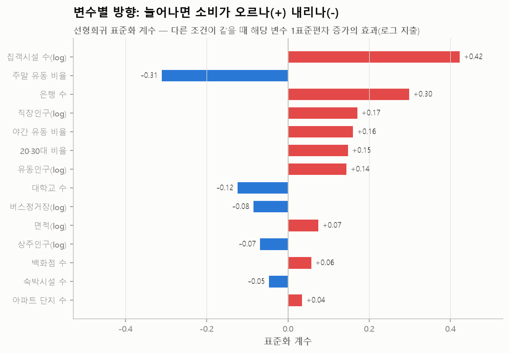

| 변수 | 방향 | 해석 |
|---|---|---|
| 집객시설 수 | + (가장 큼) | 병원·학교·관공서·역 등 사람이 모이는 시설이 많을수록 소비가 큼 |
| 주말 유동 비율 | − | 주말에만 붐비는 동네는 같은 조건에서 소비가 적음 → **평일 직장인 소비**가 상권의 기본 체력 |
| 은행 수 | + | 은행이 많은 곳 = 오피스·중심 상업지 |
| 직장인구 · 유동인구 · 야간 유동 · 20·30대 비율 | + | 일하는 사람, 저녁 인구, 청년층이 많을수록 소비 ↑ |
| 상주인구 | 약한 − | 다른 조건이 같으면 주거 비중이 큰 동은 오히려 소비가 약간 적음 |
| 대학교 수 | − | 대학가는 다른 조건이 같을 때 소비가 적게 잡힘 (학생 중심 소액 소비로 추정) |

---

### 3. 기대 vs 실제: 격차(잔차) 분석

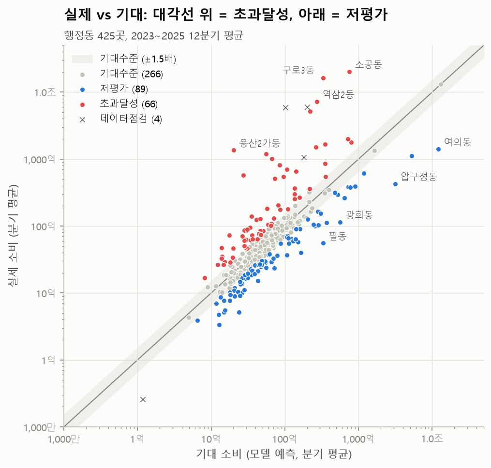
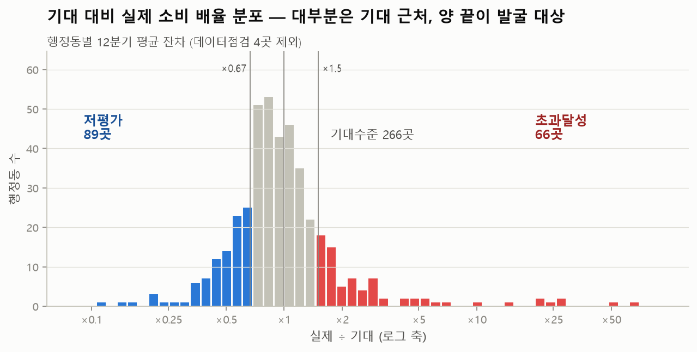

- **분포:** 대부분(266곳)은 기대의 ±1.5배 안에 있어요. 모델의 평균 오차가 약 1.6배라서 이 구간은 **“차이 없음”**으로 봅니다.
- **발굴 대상:** 양쪽 꼬리가 발굴 대상이에요. 초과달성은 66곳, 저평가는 89곳이에요.

#### 3-1. 서울 지도

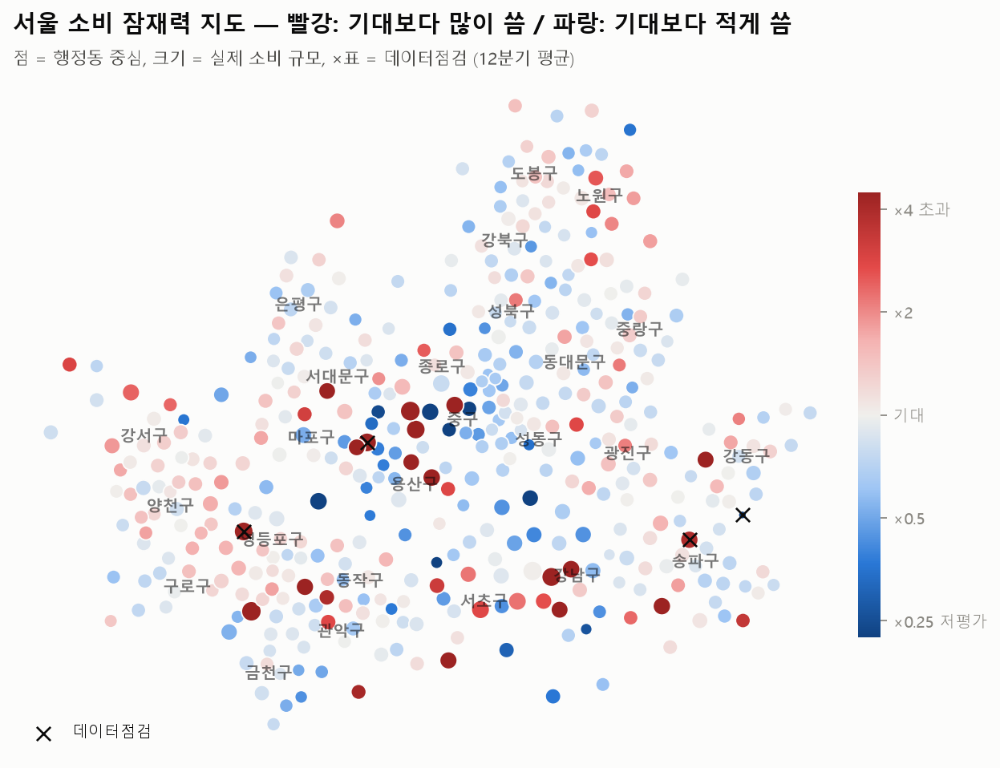

- **빨간 점(기대보다 많이 씀):** 도심(중구·종로), 강남 업무지구, 서남권(양천·구로·강서)에 퍼져 있어요.
- **파란 점(기대보다 적게 씀):** 성북·강북·금천 같은 주거지, 그리고 명동·여의동처럼 **거대 상권 바로 옆 동**에서 보여요.

#### 3-2. 초과달성 / 저평가 Top 15

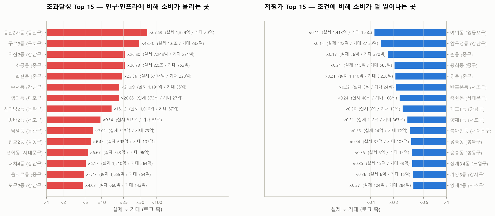

**초과달성 상위** — 용산2가동(×68), 구로3동(×48), 역삼2동(×27), 소공동(×27), 회현동(×24), 수서동(×21), 염리동(×21)
- 분기 매출이 수천억~조 원인데 인구·시설로는 설명되지 않는 곳이에요.
- **동네의 활력**이라기보다 **대형 점포나 본사 매출이 그 주소로 집계된 효과**일 가능성이 커요. 현장 확인이 필요해요.

**저평가 상위** — 여의동(×0.11), 압구정동(×0.14), 필동(×0.17), 광희동·명동(×0.21), 반포본동(×0.22)
- **명동:** 옆 소공동이 초과달성 상위라서, 매출이 이웃 동으로 잡힌 **착시**일 수 있어요.
- **여의동:** 직장인구가 22만 명이라 기대 소비가 1.2조 원으로 크게 나왔어요. 실제는 1,413억 원이에요.
- **반포본동·개포1동:** 재건축 영향으로 소비가 작은 곳이에요.
- 이런 동은 **인접 동과 묶어 보거나 제외**하고 해석하는 것이 안전해요.

---

### 4. 자치구 관점 (25개 → 425개)

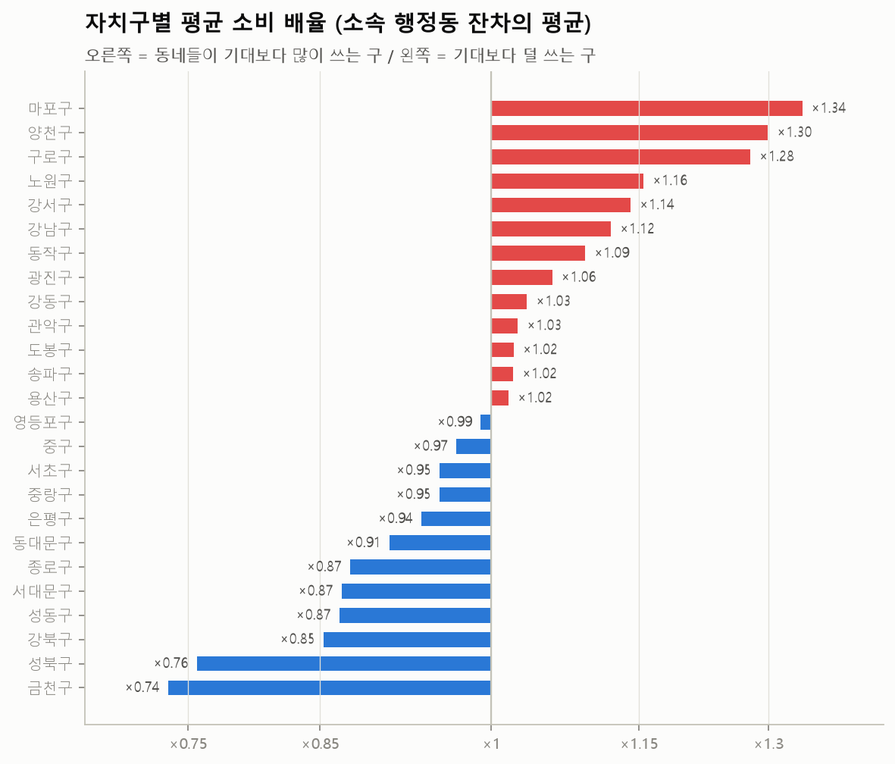
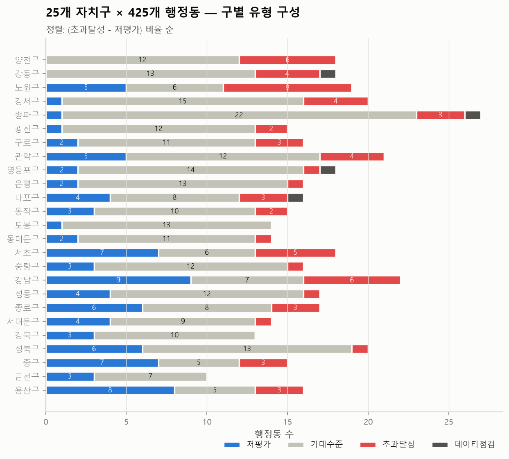

- **기대 이상인 구:** 마포(×1.34), 양천(×1.30), 구로(×1.28), 노원(×1.16), 강서(×1.14)
- **기대 이하인 구:** 금천(×0.74), 성북(×0.76), 강북(×0.85), 성동·서대문·종로(×0.87)
- **구 안의 편차:** 한 구 안에서도 편차가 커요.
  - 강남구는 초과달성 6곳과 저평가 9곳이 공존해요.
  - 용산구는 25개 구 중 저평가 비중이 가장 커요(16곳 중 8곳).
  - 그래서 **구 평균만 보고 판단하면 안 되고**, 대시보드 표에서 동 단위로 펼쳐 봐야 해요.

---

### 5. 성장 잠재 상권: 수준 × 추세

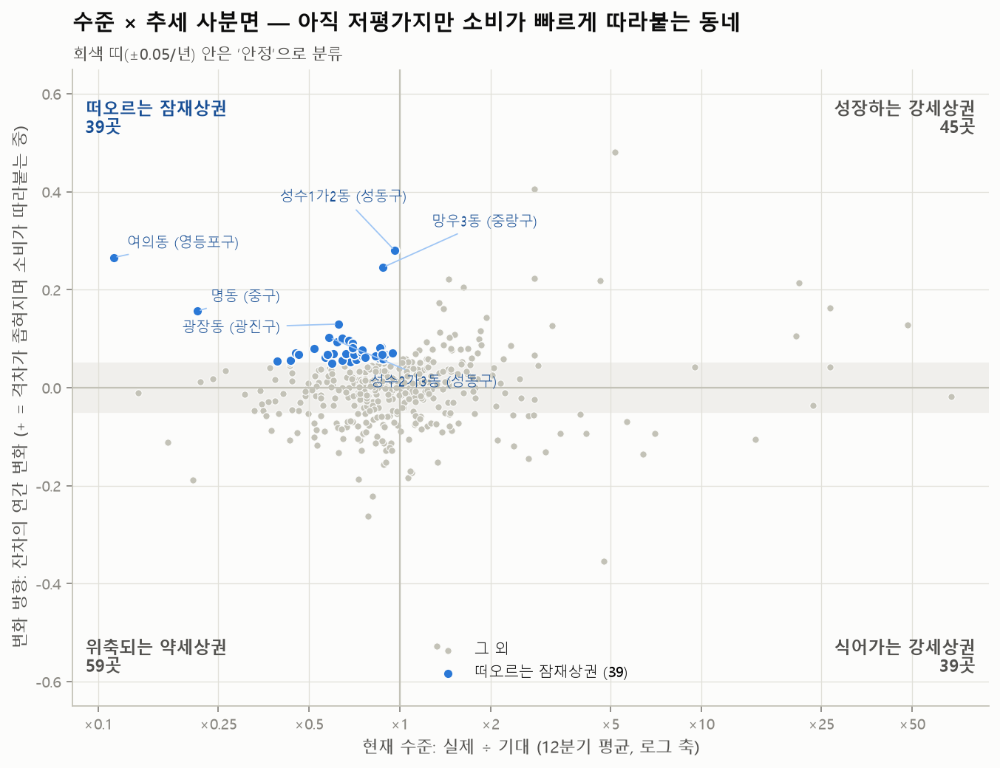

**가로축은 “지금 기대보다 얼마나 쓰나”, 세로축은 “그 격차가 해마다 어느 쪽으로 움직이나”**예요.

| 사분면 | 수 | 의미 | 예시 |
|---|---|---|---|
| **떠오르는 잠재상권** | 39 | 아직 기대보다 덜 쓰지만 따라붙는 중 | 성수1가2동, 망우3동, 광장동, 성수2가3동, 숭인1동, 창신1·2동, 제기동, 고덕1동 |
| 성장하는 강세상권 | 45 | 이미 강한데 더 강해짐 | 대치4동, 용답동, 이태원1동, 신촌동, 도곡2동, 잠실6동 |
| 식어가는 강세상권 | 39 | 강하지만 격차가 줄어드는 중 | 등촌1동, 을지로동, 이화동, 청림동, 문정2동, 상봉2동 |
| 위축되는 약세상권 | 59 | 약한데 더 약해짐 | 종로1·2·3·4가동, 광희동, 인헌동, 영등포동, 한남동 |
| 안정 | 239 | 추세 ±0.05/년 이내 | – |

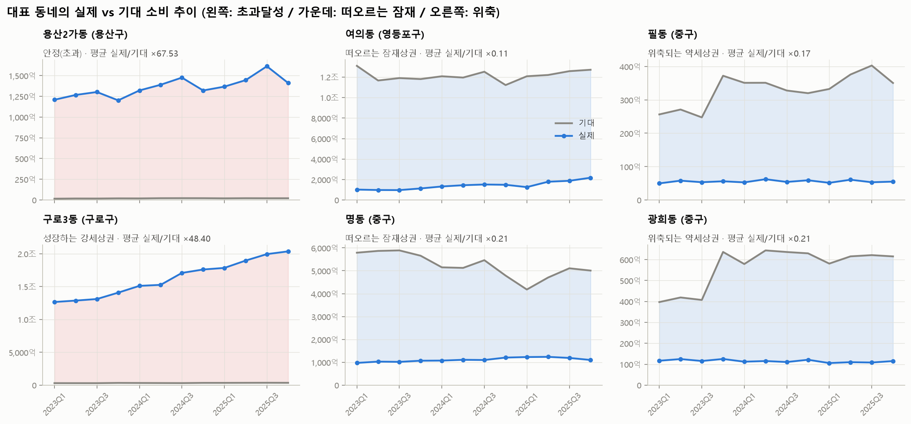

**떠오르는 잠재상권이 이 프로젝트의 핵심 발굴 대상**이에요. 인구·인프라가 받쳐 주는데 소비가 아직 덜 따라온 곳이라, 소비가 기대 수준까지 올라올 여지가 있어요.

- **성수 일대(성동구):** 1가2동과 2가3동이 모두 이 그룹에 들어가요.
- **종로 동부(숭인·창신)·제기동:** 서로 인접한 동들이 함께 포함돼 있어서, 권역 단위 변화 신호로 볼 만해요.
- **여의동·명동:** 수치상으로는 이 그룹이지만, 앞에서 말한 **집계 착시** 가능성이 있어 따로 검증해야 해요.

---

### 6. 주의사항

1. **‘지출 총금액’은 결제가 일어난 가게 주소 기준**이에요. 그 동에 사는 사람이 쓴 돈이 아니에요.
2. **잔차 = 모델이 설명하지 못한 부분**이에요. 상권 매력 외에 **집계 방식, 임대료·업종 구성 같은 누락 변수**도 섞여 있어요.
   - 이 결과는 **후보 발굴용**으로 쓰고, 현장·추가 데이터로 검증해야 해요.
3. **데이터점검 4곳**은 지출이 한 분기 사이에 수 배~수백 배 급변했거나 거의 0이라서 제외했어요.
   - **아현동·문래동:** 급변 시점이 맞물려 대형 가맹점 소재지 이전이 의심돼요.
4. **추세 값의 한계:** 추세는 12개 분기의 기울기라서 한 분기의 튀는 값에 민감해요(예: 공항동 2023Q1).

### 7. 다음 단계 제안

- **업종 단위 분석:** 상권 단위 추정매출(`T_PJT2/data/raw/상권/OA-15572`)로 업종별 모델을 만들면, “무엇이 부족한 저평가인지”를 알 수 있어요.
- **인접 동 효과:** 인접 동 합산이나 공간 시차(spatial lag) 변수를 넣으면 명동·소공동 같은 **이웃 효과**를 줄일 수 있어요.
- **변수 추가:** 임대료, 점포 수, 개폐업률(`OA-15577` 점포, `OA-15576` 상권변화지표)을 더해 설명력을 높일 수 있어요.
- **2026년 검증:** 2026Q1–Q2 데이터로 “떠오르는 잠재상권이 실제로 따라붙었는지” 사후 검증할 수 있어요.

---

## 2부. 분석 방법 및 데이터 정의

주제: **인구·인프라 기반 기대 소비 예측 모델과 ‘소비 잠재력’ 상권 발굴**
질문: 인구와 인프라에 비해 실제 소비가 기대보다 많은(초과달성) 동네, 기대보다 적은(저평가) 동네는 어디인가?

---

### 1. 분석 단위

| 항목 | 내용 |
|---|---|
| 공간 | 서울 **25개 자치구 → 425개 행정동** (행정동 코드 앞 5자리 = 자치구 코드) |
| 시간 | 2023Q1 ~ 2025Q4, **12분기** |
| 행 수 | 425 × 12 = **5,100행** |

자치구별 행정동 수 (합계 425)

| 행정동 수 | 자치구 |
|---|---|
| 27 | 송파 |
| 22 | 강남 |
| 21 | 관악 |
| 20 | 성북, 강서 |
| 19 | 노원 |
| 18 | 양천, 영등포, 서초, 강동 |
| 17 | 종로, 성동 |
| 16 | 용산, 중랑, 은평, 마포, 구로 |
| 15 | 중구, 광진, 동작 |
| 14 | 동대문, 도봉, 서대문 |
| 13 | 강북 |
| 10 | 금천 |

### 2. 사용 데이터 (원본은 수정하지 않음)

| 역할 | 원본 파일 (`T_PJT2/data/…`) | 사용 컬럼 |
|---|---|---|
| **타깃** | `raw/OA-22166_소비_행정동.csv` | 지출_총금액 |
| 상주인구 | `processed/panel_행정동_분기_2023_2025.csv` | SKT_총인구 (없으면 상권분석 상주인구로 대체) |
| 상주인구 구성 | `raw/OA-22183_상주인구_행정동.csv` | 20·30대 인구, 총/아파트 가구 수 |
| 직장인구 | `raw/OA-22184_직장인구_행정동.csv` | 총_직장_인구_수 |
| 유동인구 | `raw/OA-22178_길단위인구_행정동.csv` | 총 유동인구, 17~24시, 토·일 |
| 인프라 | `raw/OA-22169_집객시설_행정동.csv` | 집객시설, 지하철·철도역, 버스정거장, 백화점, 대학교, 숙박, 극장, 병원, 은행, 관공서, 학교, 슈퍼마켓 |
| 주거 | `raw/OA-22163_아파트_행정동.csv` | 아파트 단지 수, 평균 시가 |
| 공간 | `raw/OA-22160_영역_행정동.csv` | 중심 좌표(EPSG:5181 → WGS84), 면적 |
| 자치구명 | `raw/OA-22182_상주인구_자치구.csv` | 자치구 코드 ↔ 이름 |

> **왜 SKT 인구를 썼나?** 상권분석 상주인구는 재건축 입주를 늦게 반영한다(둔촌1동 16명 vs SKT 22,127명). 팀 README의 품질 이슈 ③을 따랐다.

### 3. 변수 (모델 입력 27개)

| 그룹 | 변수 |
|---|---|
| 인구 | log 상주인구, log 직장인구, log 유동인구, 20·30대 비율, 야간(17–24시) 유동 비율, 주말 유동 비율 |
| 인프라 | log 집객시설, 지하철역, 철도역, log 버스정거장, 백화점, 대학교, 숙박시설, 극장, 병원, 은행, 관공서, 초중고, 슈퍼마켓 |
| 주거 | 아파트 단지 수, log 아파트 가구, 아파트 가구 비율, log 아파트 평균시가(+결측 표시) |
| 공간·시간 | log 면적, 시점(0~11), 계절(1~4분기) |

### 4. 극단값 처리

1. **로그 변환**: 지출·인구·시설 수에 log(1+x)를 적용했다. 소공동 한 곳이 분기 2조 원을 넘는 등 분포가 한쪽으로 크게 쏠려 있기 때문이다(`image/01`).
   결과는 “기대의 몇 배”(배율)로 읽는다.
2. **데이터점검 플래그**: 아래 4개 동은 **학습에서 제외**했다. 예측·잔차는 계산하되 순위와 해석에서는 뺀다.

| 행정동 | 사유 | 근거 |
|---|---|---|
| 아현동 (마포) | 지출 급변 | 2024Q4 4,186억 → 2025Q1 62억 |
| 문래동 (영등포) | 지출 급변 | 2024Q3 121억 → 2024Q4 8,999억 |
| 방이2동 (송파) | 지출 급변 | 2023Q4 172억 → 2024Q2 1,794억 |
| 둔촌1동 (강동) | 지출 거의 없음 | 분기 1억 미만 (재건축) |

- **급변 기준**: 인접 분기 log 지출 차이가 1.4(약 4배)를 넘는 경우.
- **아현동·문래동**: 급변 시점이 맞물려 대형 가맹점의 소재지 이전 등 **집계 기준 변화**로 추정한다.

### 5. 모델과 검증

- 비교 모델은 **선형회귀(Ridge)**, 랜덤포레스트, 그래디언트부스팅 세 가지다.
- **검증 방식**: GroupKFold(5) 교차검증으로, **행정동 단위로 폴드를 나눴다**.
  - 같은 동의 12분기가 학습과 검증에 동시에 들어가면, 모델이 그 동의 고유한 수준까지 외워 잔차가 사라진다.
  - 그래서 모든 기대값은 “그 동을 한 번도 보지 못한 모델”의 예측(out-of-fold)이다.

| 모델 | R² | 겹별 편차 | 평균 오차(배율) |
|---|---|---|---|
| **선형회귀(Ridge)** ✓ | **0.634** | ±0.033 | ×1.60 |
| 랜덤포레스트 | 0.632 | ±0.043 | ×1.60 |
| 그래디언트부스팅 | 0.587 | ±0.046 | ×1.63 |

선형회귀를 채택했다. 성능은 랜덤포레스트와 비슷하지만 계수로 방향을 해석할 수 있다.

### 6. 잔차 → 지표 정의

| 지표 | 정의 |
|---|---|
| 잔차 | log(실제 지출) − log(기대 지출) |
| **배율** | exp(12분기 평균 잔차) = 실제 ÷ 기대 |
| 연간 추세 | 12분기 잔차의 선형 기울기 × 4 (+면 실제가 기대에 비해 점점 늘어남) |
| **유형** | 초과달성: 배율 ≥ 1.5 · 저평가: 배율 ≤ 0.67 · 그 사이: 기대수준 |
| **사분면** | 수준(배율 1 기준) × 추세(±0.05/년 밖). 추세가 띠 안이면 ‘안정’ |

사분면은 다음 네 가지로 나뉜다.

- **떠오르는 잠재상권**: 배율 < 1, 추세 > +0.05
- **위축되는 약세상권**: 배율 < 1, 추세 < −0.05
- **성장하는 강세상권**: 배율 ≥ 1, 추세 > +0.05
- **식어가는 강세상권**: 배율 ≥ 1, 추세 < −0.05

### 7. 한계

- **타깃의 집계 기준**: 타깃은 결제가 일어난 가게 주소 기준이다. 대형 점포나 본사 매출이 한 동에 몰리면 초과달성으로 보이고, 그 인접 동은 저평가로 보일 수 있다.
- **누락 변수**: 임대료, 업종 구성, 관광객, 온라인 결제 등은 모델에 없다. 잔차에는 이런 요인도 섞여 있다.
- **추세의 불안정성**: 추세는 12개 점의 기울기라서 한 분기 스파이크에 민감하다. 예를 들어 공항동은 2023Q1 한 분기만 278억 원이다.
- **좌표의 한계**: 좌표는 행정동 중심점이다. 경계 폴리곤이 없어 지도는 점으로 그렸다.

### 8. 재현 방법

```bash
cd T_PJT2/Clau_pjt
PYTHONUTF8=1 python src/01_build_dataset.py      # → data/dataset_행정동_분기_2023_2025.csv
PYTHONUTF8=1 python src/02_model_residual.py     # → data/residual_*, model_*, feature_importance.csv
PYTHONUTF8=1 python src/03_visualize.py          # → image/*.png (13종)
PYTHONUTF8=1 python src/04_export_dashboard.py   # → report/dashboard/data.js, lib/plotly.min.js
```

필요 패키지: Python 3.12, pandas, numpy, scikit-learn, matplotlib, plotly(대시보드 JS 복사용), pyproj.

### 9. 산출 파일 사전 (`Clau_pjt/data`)

| 파일 | 행 | 설명 |
|---|---|---|
| `dataset_행정동_분기_2023_2025.csv` | 5,100 | 결합·파생 변수 전체 |
| `residual_행정동_분기.csv` | 5,100 | 분기별 실제·기대·잔차·배율, 3개 모델의 OOF 예측 |
| `residual_행정동_요약.csv` | 425 | 동별 평균 배율·추세·유형·사분면·좌표 |
| `residual_자치구_요약.csv` | 25 | 구별 합계·평균 배율·유형 개수 |
| `model_performance.csv` | 3 | 모델 비교 |
| `feature_importance.csv` | 27 | 순열 중요도 |
| `ridge_coefficients.csv` | 27 | 표준화 계수 |
| `model_summary.json` | – | 채택 모델, 유형·사분면 개수 |
